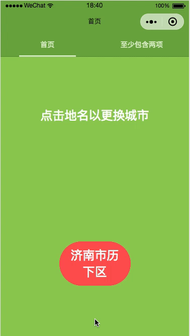

# 微信小程序 城市/区县定位选择器(mpvue版本)

> 一款开箱即用的小程序城市/区县选择器

前两天在实现一个城市选择器的需求的时候，在github上看到了[BeijiYang](https://github.com/BeijiYang)同学的开源项目，觉得做的非常不错，不过是基于原生小程序写的，所以就花了点时间把他的项目基于mpvue框架改写了。方便让使用mpvue框架的同学使用。

贴一下原项目的地址，还在使用小程序自带框架的同学可以使用这个库哦 [项目地址](https://github.com/BeijiYang/citySelector)

## 技术栈
`javascript + es6 + mpvue + vuex`

跟原项目相比 使用了vuex来管理数据，使数据管理更为方便，贴近真实mpvue项目

## 主要功能
* **自动定位** 城市、区县（也支持手动重新定位）
* 手动 **汉字、拼音搜索** 城市，支持搜索数量335个，覆盖地级市
* 亦可通过 **侧边栏** 选择，城市按拼音首字母排列
* 选择好城市后，自动显示 **辖下区县**

## 动画演示

在真机预览的动画是非常流畅的



## 运行
```bash
1、git clone
$ git clone https://github.com/originalix/citySelector.git

2、安装依赖
$ cd citySelector && npm install

3、启动程序
$ npm run dev

4、预览
打开微信开发者工具，新建项目，将目录指向 /dist 即可

勾选详情内不校验合法域名选项
```

### 说明
* 使用（且小程序只能使用）腾讯地图的API
* 将utils目录中，`config.js`文件中key换成自己申请的，目前只是我的测试key
* 并将其中的`key`改为自己的腾讯地图key（申请快速且免费）
* 可 **直接作为模块使用，如果对您有帮助，请star**
